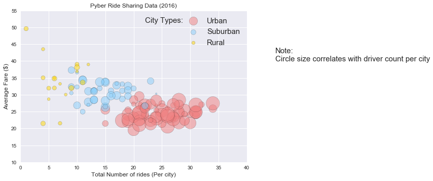
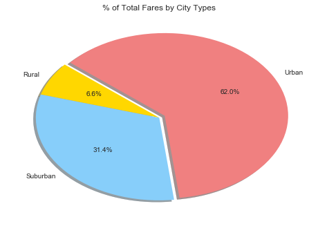
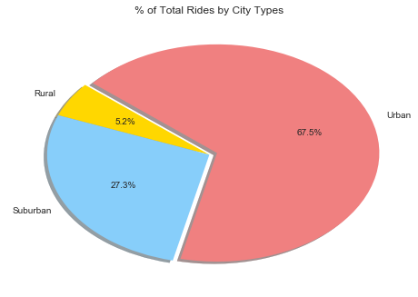
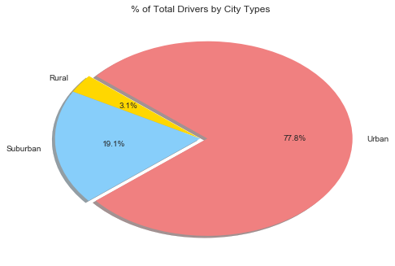

```python
# Obeserved Trend 1: In Rural and Suburban areas, the average fare have a large diversity, especially in Rural area. 
#                    However, in Urban area, the average fare is very stable.
# Obeserved Trend 2: Rural area and Suburban area in general have higher average fare compared to urban area
# Obeserved Trend 3: The total number of drivers and the total number of rides are positively related,
#                    areas with more drivers have more orders.
```


```python
import matplotlib.pyplot as plt
import pandas as pd
import numpy as np
import matplotlib as mpl
import math
```


```python
file_city = "city_data.csv"
file_ride = "ride_data.csv"
```


```python
city = pd.read_csv(file_city)
ride = pd.read_csv(file_ride)
```


```python
city.head()
```


<div>
<style>
    .dataframe thead tr:only-child th {
        text-align: right;
    }

    .dataframe thead th {
        text-align: left;
    }

    .dataframe tbody tr th {
        vertical-align: top;
    }
</style>
<table border="1" class="dataframe">
  <thead>
    <tr style="text-align: right;">
      <th></th>
      <th>city</th>
      <th>driver_count</th>
      <th>type</th>
    </tr>
  </thead>
  <tbody>
    <tr>
      <th>0</th>
      <td>Kelseyland</td>
      <td>63</td>
      <td>Urban</td>
    </tr>
    <tr>
      <th>1</th>
      <td>Nguyenbury</td>
      <td>8</td>
      <td>Urban</td>
    </tr>
    <tr>
      <th>2</th>
      <td>East Douglas</td>
      <td>12</td>
      <td>Urban</td>
    </tr>
    <tr>
      <th>3</th>
      <td>West Dawnfurt</td>
      <td>34</td>
      <td>Urban</td>
    </tr>
    <tr>
      <th>4</th>
      <td>Rodriguezburgh</td>
      <td>52</td>
      <td>Urban</td>
    </tr>
  </tbody>
</table>
</div>


```python
ride.head()
```


<div>
<style>
    .dataframe thead tr:only-child th {
        text-align: right;
    }

    .dataframe thead th {
        text-align: left;
    }

    .dataframe tbody tr th {
        vertical-align: top;
    }
</style>
<table border="1" class="dataframe">
  <thead>
    <tr style="text-align: right;">
      <th></th>
      <th>city</th>
      <th>date</th>
      <th>fare</th>
      <th>ride_id</th>
    </tr>
  </thead>
  <tbody>
    <tr>
      <th>0</th>
      <td>Sarabury</td>
      <td>2016-01-16 13:49:27</td>
      <td>38.35</td>
      <td>5403689035038</td>
    </tr>
    <tr>
      <th>1</th>
      <td>South Roy</td>
      <td>2016-01-02 18:42:34</td>
      <td>17.49</td>
      <td>4036272335942</td>
    </tr>
    <tr>
      <th>2</th>
      <td>Wiseborough</td>
      <td>2016-01-21 17:35:29</td>
      <td>44.18</td>
      <td>3645042422587</td>
    </tr>
    <tr>
      <th>3</th>
      <td>Spencertown</td>
      <td>2016-07-31 14:53:22</td>
      <td>6.87</td>
      <td>2242596575892</td>
    </tr>
    <tr>
      <th>4</th>
      <td>Nguyenbury</td>
      <td>2016-07-09 04:42:44</td>
      <td>6.28</td>
      <td>1543057793673</td>
    </tr>
  </tbody>
</table>
</div>


```python
city_ride = pd.merge(city,ride,on="city",how="outer")
city_ride_group = city_ride.groupby(["city","type"])
city_ride_avg = pd.DataFrame(round(city_ride_group[["fare","driver_count"]].mean(),2)).reset_index()
city_ride_count = pd.DataFrame(city_ride_group["ride_id"].count()).reset_index()
df = pd.merge(city_ride_avg,city_ride_count,on = ["city","type"],how="outer")
df = df.rename(columns={"ride_id":"ride_count"})
df.head()

```


<div>
<style>
    .dataframe thead tr:only-child th {
        text-align: right;
    }

    .dataframe thead th {
        text-align: left;
    }

    .dataframe tbody tr th {
        vertical-align: top;
    }
</style>
<table border="1" class="dataframe">
  <thead>
    <tr style="text-align: right;">
      <th></th>
      <th>city</th>
      <th>type</th>
      <th>fare</th>
      <th>driver_count</th>
      <th>ride_count</th>
    </tr>
  </thead>
  <tbody>
    <tr>
      <th>0</th>
      <td>Alvarezhaven</td>
      <td>Urban</td>
      <td>23.93</td>
      <td>21</td>
      <td>31</td>
    </tr>
    <tr>
      <th>1</th>
      <td>Alyssaberg</td>
      <td>Urban</td>
      <td>20.61</td>
      <td>67</td>
      <td>26</td>
    </tr>
    <tr>
      <th>2</th>
      <td>Anitamouth</td>
      <td>Suburban</td>
      <td>37.32</td>
      <td>16</td>
      <td>9</td>
    </tr>
    <tr>
      <th>3</th>
      <td>Antoniomouth</td>
      <td>Urban</td>
      <td>23.62</td>
      <td>21</td>
      <td>22</td>
    </tr>
    <tr>
      <th>4</th>
      <td>Aprilchester</td>
      <td>Urban</td>
      <td>21.98</td>
      <td>49</td>
      <td>19</td>
    </tr>
  </tbody>
</table>
</div>


```python
size1 = df.loc[df["type"] == "Urban",:]["driver_count"]
ride_count1 = df.loc[df["type"] == "Urban",:]["ride_count"]
fare1 = df.loc[df["type"] == "Urban",:]["fare"]

size2 = df.loc[df["type"] == "Suburban",:]["driver_count"]
ride_count2 = df.loc[df["type"] == "Suburban",:]["ride_count"]
fare2 = df.loc[df["type"] == "Suburban",:]["fare"]

size3 = df.loc[df["type"] == "Rural",:]["driver_count"]
ride_count3 = df.loc[df["type"] == "Rural",:]["ride_count"]
fare3 = df.loc[df["type"] == "Rural",:]["fare"]
```


```python
mpl.style.use('seaborn')
plt.scatter(ride_count1,fare1,c="lightcoral", edgecolors="black",
            s=size1*11, alpha=.5, marker = "o",label = "Urban")
plt.scatter(ride_count2,fare2,c="lightskyblue", edgecolors="black",
            s=size2*11, alpha=.5, marker = "o",label = "Suburban")
plt.scatter(ride_count3,fare3,c="gold", edgecolors="black",
            s=size3*11, alpha=.5, marker = "o",label="Rural") 
plt.title("Pyber Ride Sharing Data (2016)")
plt.text(22,51.5,"City Types: ",fontsize=15)
plt.legend(loc = "best",markerscale=0.8,scatterpoints = 1,fontsize=15)
plot.rcParams.update(params)
plt.ylim(10, 55)
plt.xlim (0, 40)
plt.grid(color="white")
plt.text(45,40,"Note:\nCircle size correlates with driver count per city",fontsize=15)
plt.xlabel('Total Number of rides (Per city)', fontsize = 12)
plt.ylabel('Average Fare ($)', fontsize = 12)
plt.show()
```





```python
city_ride.groupby("type")["fare"].sum() # distribution of total Fares by city types
```


    type
    Rural        4255.09
    Suburban    20335.69
    Urban       40078.34
    Name: fare, dtype: float64


```python
# Pie chart: % of Total Fares by City Types
city_types = ["Rural","Suburban","Urban"]
colors = ["Gold", "LightSkyBlue", "LightCoral"]
percent = [4255.09,20335.69,40078.34]
explode = (0,0,0.05)
plt.pie(percent, explode=explode, labels=city_types, colors=colors,
        autopct="%1.1f%%", shadow=True, startangle=140)
plt.title("% of Total Fares by City Types")
plt.show()
```





```python
city_ride.groupby("type")["ride_id"].count() # distribution of total rides numbers by city types
```


    type
    Rural        125
    Suburban     657
    Urban       1625
    Name: ride_id, dtype: int64


```python
# Pie chart: % of Total Rides by City Types
city_types = ["Rural","Suburban","Urban"]
colors = ["Gold", "LightSkyBlue", "LightCoral"]
percent = [125,657,1625]
explode = (0,0,0.05)
plt.pie(percent, explode=explode, labels=city_types, colors=colors,
        autopct="%1.1f%%", shadow=True, startangle=140)
plt.title("% of Total Rides by City Types")
plt.show()
```





```python
city.groupby("type")["driver_count"].sum() # distribution of total diver numbers by city types
```


    type
    Rural        104
    Suburban     638
    Urban       2607
    Name: driver_count, dtype: int64


```python
# Pie chart: % of Total Drivers by City Types
city_types = ["Rural","Suburban","Urban"]
colors = ["Gold", "LightSkyBlue", "LightCoral"]
percent = [104,638,2607]
explode = (0,0,0.05)
plt.pie(percent, explode=explode, labels=city_types, colors=colors,
        autopct="%1.1f%%", shadow=True, startangle=140)
plt.title("% of Total Drivers by City Types")
plt.show()
```




